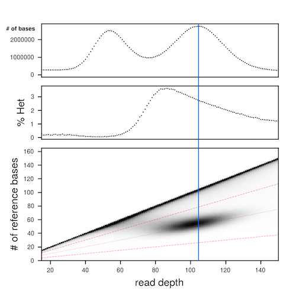

# chep
Calculate Heterozygosity with Pileup


# Contents
- Introduction
- Installation
- Usage
- License
- Citation

# Introduction

This program is useful to:
  - calculate and visualize the heterozygosity of a genome assembly
  - to visualize ploidy
  - and to determine if the genome is sufficiently haplotype-collapsed.
  
It works by scanning a bam file with `mpileup` and asking the questions, "What is the read depth at this position, and how many bases match the reference base?" This information is turned into a 3D histogram, where:
  - Column 0 is the read depth
  - Column 1 is how many reads had the reference allele at that position
  - Column 3 is the number of positions in the genome that match Columns 0 and 1
  
This 3D histogram is then used to generate plots of the marginal histogram of read depths across the whole genome (top panel), the heterozygosity calculated at every specific read depth (middle panel), and a plot of the underlying 3D histogram (bottom panel).



Starting with the bottom panel - this is the plot of the 3D histogram. The purpose of this plot is to visualize where the large smudge is that falls at approximately 1/2 of the read depth coverage at that position. This smudge is a histogram of the heterozygous positions in the genome, supported by sequencing reads aligned in a bam file. The red dashed lines are the bounding lines for calculating heterozygosity later on. In later calculations `chep` considers everything between the top-most and bottom-most red dashed lines to be heterozygous sites. Everything above the top-most red dashed line is considered to be a homozygous site. The blue vertical line is drawn through the region of the plot that will most accurately estimate the SNP/short-indel heterozygosity.

The middle panel shows the calculated heterozygosity for that depth. For each read depth the total number of heterozygous sites is divided by the total number of bases. To be more explicit, to calculate the heterozygosity at the blue vertical line (x=107), we count the number of heterozygous positions at read depth 107 between the dashed red lines, then divide that number by the total number of bases with read depth=107. The heterozygosity to the left of the blue line is overestimated (lots of noise, good signal), the heterozygosity ON the blue line is the most accurate (little noise, lots of signal), and the heterozygosity to the right of the blue line is underestimated (little noise, little signal).

The top panel, the histogram of read depth across the entire genome, is good for QC'ing (A) whether or not the genome assembly has uncollapsed haplotigs, and for determining the mode of the coverage depth for the reads (lambda). In the example plot above, we can see that there are two peaks. The peak with a mode around 55 is from uncollapsed haplotigs, and the peak with the mode around 107 is from properly collapsed regions of the genome. From this plot we learn that mode of coverage for the genome (lambda) is 107 (blue vertical line), and therefore this is the best place to measure the heterozygosity.

*Summary* - with these three plots, you can diagnose many basic properties of a genome assembly! 

NB - this program is written with the assumption that the reads being mapped against the genome are from the same individual that was used to generate the genome assembly. Otherwise, the estimates of heterozygosity will be wrong, and there will be many positions that do not have the reference base whatsoever (black streak along the bottom of the lower panel).

# Installation

To install, go to a directory where you want to install the program. Execute:

```
git clone https://github.com/conchoecia/chep.git
cd chep
make
```

Currently, `chep` doesn't automatically install the scripts into a system-wide location. As a result you must add the following line to your `~/.bash_profile` or `~/.bashrc` file.

```
export PATH=$PATH:/home/dschultz/chep/bin
```

# Usage

First, generate a bam file of shotgun long- or short reads to a reference genome. Then, run `mpileup` on the bam and pipe the output into `chep`.

**Important: Always use these samtools mpileup options: `-B -Q 0 -q 0 -A -R`**

```
samtools mpileup -B -Q 0 -q 0 -A -R -f ref.fa shot_to_ref.sorted.bam | chep_pileup_to_array > chep_3D.txt
```

The samtools mpileup flags:
- `-B` : Disable base alignment quality (BAQ) computation
- `-Q 0` : Skip bases with base quality smaller than 0 (include all bases)
- `-q 0` : Skip alignments with mapping quality smaller than 0 (include all alignments)
- `-A` : Count anomalous read pairs
- `-R` : Output all reads regardless of read group

## Processing multiple BAM files

For large numbers of BAM files, use the batch processing script with GNU parallel:

```
# Process 768 BAMs in batches of 50, using 32 parallel jobs
./scripts/process_bams_in_batches.sh reference.fa bam_list.txt output.txt 32
```

Or use the Snakemake workflow for distributed processing on SLURM clusters:

```
Or use the Snakemake workflow for distributed processing on SLURM clusters:

```bash
# Submit Snakemake workflow to SLURM (processes each BAM independently)
# Resources are dynamically allocated based on BAM file sizes
sbatch scripts/bash_scripts/submit_chep_snakemake.sh reference.fa bam_list.txt output.txt 100

# For non-human genomes, specify genome size in Gbp
snakemake -s scripts/snakemake_scripts/Snakefile_chep_multi_bam.snakemake \
    --config ref=reference.fa bam_list=bam_list.txt output=output.txt genome_size_gb=0.5 \
    --executor slurm --jobs 100
```

The Snakemake workflow dynamically allocates resources based on:
- **BAM file size**: Larger BAMs get more memory and time
- **Number of files**: Merge step scales with file count
- Empirical benchmarks: 283MB BAM with 3Gbp genome takes ~13min and ~412MB RAM
```

## Plotting results

Then plot the results. Add your own parameters for `-x x_min` and `-X x_max`, or `-d` to make the plot on a back background. 

```
chep_plot -f chep_3D.txt -x 0 -X 200 -d
```

# License

Chep is free software and is licensed under GPLv3.

# Citation

Currently there is no way to cite this software aside from citing this github page.
